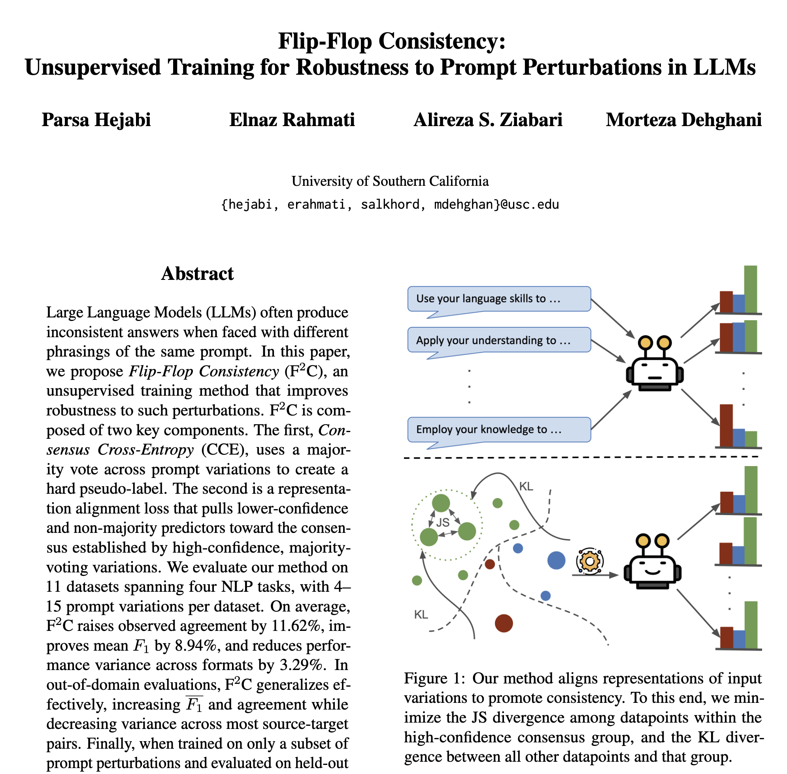

# 🩴 Flip-Flop Consistency: Unsupervised Training for Robustness to Prompt Perturbations in LLMs

By Parsa Hejabi, Elnaz Rahmati, Alireza Salkhordeh Ziabari, Morteza Dehghani - University of Southern California

ArXiv preprint 👉 [https://arxiv.org/abs/2510.14242](https://arxiv.org/abs/2510.14242)

The repository will be updated with the code soon. Stay tuned!

<p align="center">
  
</p>

## Abstract

Large Language Models (LLMs) often produce inconsistent answers when faced with different phrasings of the same prompt. In this paper, we propose **Flip-Flop Consistency** $(F^2C)$, an unsupervised training method that improves robustness to such perturbations. $F^2C$ is composed of two key components. The first, **Consensus Cross-Entropy** (CCE), uses a majority vote across prompt variations to create a hard pseudo-label. The second is a representation alignment loss that pulls lower-confidence and non-majority predictors toward the consensus established by high-confidence, majority-voting variations.
We evaluate our method on 11 datasets spanning four NLP tasks, with 4--15 prompt variations per dataset. On average, $F^2C$ raises observed agreement by 11.62\%, improves mean $F_1$ by 8.94\%, and reduces performance variance across formats by 3.29\%. In out-of-domain evaluations, $F^2C$ generalizes effectively, increasing $\overline{F_1}$ and agreement while decreasing variance across most source-target pairs. Finally, when trained on only a subset of prompt perturbations and evaluated on held-out formats, $F^2C$ consistently improves both performance and agreement while reducing variance.
These findings highlight $F^2C$ as an effective unsupervised method for enhancing LLM consistency, performance, and generalization under prompt perturbations.

## Reference

If you use or build upon this work, please cite:

```bibtex
@misc{hejabi2025flipflopconsistencyunsupervisedtraining,
  title={Flip-Flop Consistency: Unsupervised Training for Robustness to Prompt Perturbations in LLMs},
  author={Parsa Hejabi and Elnaz Rahmati and Alireza S. Ziabari and Morteza Dehghani},
  year={2025},
  eprint={2510.14242},
  archivePrefix={arXiv},
  primaryClass={cs.CL},
  url={https://arxiv.org/abs/2510.14242},
}
```
