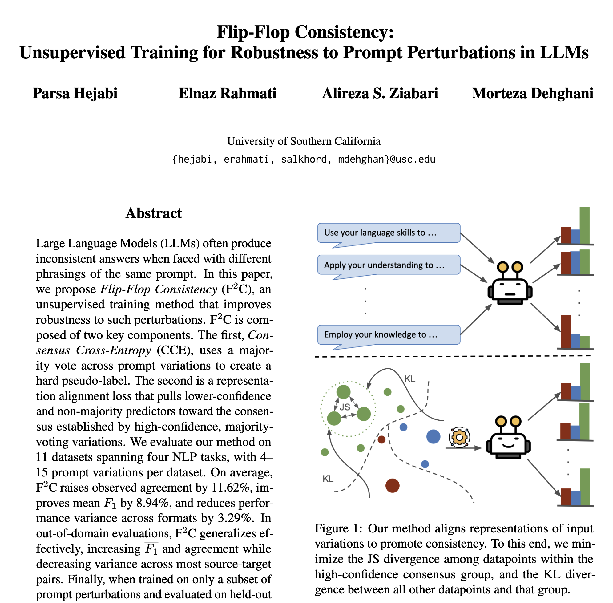

# Flip-Flop Consistency

Official code for **Flip-Flop Consistency: Unsupervised Training for Robustness
to Prompt Perturbations in LLMs**, published at ACL 2026.

Flip-Flop Consistency (F2C) trains a model without gold labels by combining:

1. **Consensus Cross-Entropy (CCE):** uses a strict majority vote across
   semantically equivalent prompt formats as a hard pseudo-label.
2. **Selective representation alignment:** aligns lower-confidence and
   non-majority prompt variations toward confident majority voters.

Paper: [ACL Anthology](https://aclanthology.org/2026.acl-long.71/) ([PDF](https://aclanthology.org/2026.acl-long.71.pdf))

<p align="center">
  
</p>

## Repository Contents

| Path | Purpose |
| --- | --- |
| `main.py` | Main training and evaluation entry point |
| `flipflop_trainer.py` | F2C, CCE, and swarm-distillation objectives |
| `dataloader.py`, `data_collator.py` | Dataset, PromptSource, and decoder-only input handling |
| `scripts/run_study1.py` | Public launcher for base, swarm, CCE, and F2C runs |
| `configs/study1.json` | Dataset definitions and paper-reported F2C hyperparameters |
| `study_2/study_2_main.py` | Cross-dataset transfer evaluation |
| `study_3/study_3_eval.py` | Held-out prompt-format evaluation |
| `analysis/` | Checkpoint and dataset-level result aggregation |
| `docs/REPRODUCIBILITY.md` | Detailed reproduction protocol |

Generated datasets, model checkpoints, W&B logs, and paper source files are not
included.

## Setup

The paper experiments used Python 3.9, PyTorch 2.8.0, Transformers 4.56.1,
PEFT 0.17.1, Accelerate 1.10.1, and Datasets 4.1.0.

```bash
git clone git@github.com:ParsaHejabi/Flip-Flop-Consistency-Unsupervised-Training-for-Robustness-to-Prompt-Perturbations-in-LLMs.git
cd Flip-Flop-Consistency-Unsupervised-Training-for-Robustness-to-Prompt-Perturbations-in-LLMs

python3.9 -m venv venv
source venv/bin/activate
pip install --upgrade pip
pip install -r requirements.txt
```

Qwen downloads automatically. Llama requires accepting the model license on
Hugging Face and authenticating with `huggingface-cli login`.

## Quick Start

Run F2C on RTE with the paper-reported configuration:

```bash
python scripts/run_study1.py --dataset rte --method f2c
```

Inspect the generated command without launching training:

```bash
python scripts/run_study1.py --dataset rte --method f2c --dry-run
```

Evaluate the unmodified base model or run a baseline:

```bash
python scripts/run_study1.py --dataset rte --method base
python scripts/run_study1.py --dataset rte --method swarm
python scripts/run_study1.py --dataset rte --method cce
```

Outputs are written under `outputs/<dataset>/`. Dataset renderings and
deterministic split metadata are cached under `data/`.

## Datasets

The experiments use ANLI R1/R2/R3, CB, RTE, COPA, HellaSwag, StoryCloze 2016,
WSC, WinoGrande-XL, and WiC with original-task templates from PromptSource.
All datasets except StoryCloze are downloaded through Hugging Face Datasets.

StoryCloze must be requested from the
[ROCStories website](https://www.cs.rochester.edu/nlp/rocstories/). See
[`docs/REPRODUCIBILITY.md`](docs/REPRODUCIBILITY.md) for setup details.

## Reproducing the Paper

The release includes the three paper protocols:

- **Study 1:** per-dataset base, swarm, CCE, and F2C evaluation.
- **Study 2:** evaluate a Study 1 F2C checkpoint on the other datasets.
- **Study 3:** train on the first K prompt formats and evaluate on held-out
  formats.

Commands, split details, checkpoint selection notes, compute requirements, and
known reproducibility constraints are documented in
[`docs/REPRODUCIBILITY.md`](docs/REPRODUCIBILITY.md).

## Citation

```bibtex
@inproceedings{hejabi-etal-2026-flip,
    title = "Flip-Flop Consistency: Unsupervised Training for Robustness to Prompt Perturbations in {LLM}s",
    author = "Hejabi, Parsa  and
      Rahmati, Elnaz  and
      Salkhordeh Ziabari, Alireza  and
      Dehghani, Morteza",
    editor = "Liakata, Maria  and
      Moreira, Viviane P.  and
      Zhang, Jiajun  and
      Jurgens, David",
    booktitle = "Proceedings of the 64th Annual Meeting of the {A}ssociation for {C}omputational {L}inguistics (Volume 1: Long Papers)",
    month = jul,
    year = "2026",
    address = "San Diego, California, United States",
    publisher = "Association for Computational Linguistics",
    url = "https://aclanthology.org/2026.acl-long.71/",
    pages = "1571--1587",
    ISBN = "979-8-89176-390-6",
    abstract = "Large Language Models (LLMs) often produce inconsistent answers when faced with different phrasings of the same prompt. In this paper, we propose Flip-Flop Consistency (F$^2$C), an unsupervised training method that improves robustness to such perturbations. F$^2$C is composed of two key components. The first, Consensus Cross-Entropy (CCE), uses a majority vote across prompt variations to create a hard pseudo-label.
The second is a representation alignment loss that pulls lower-confidence and non-majority predictors toward the consensus established by high-confidence, majority-voting variations. We evaluate our method on 11 datasets spanning four NLP tasks, with 4{--}15 prompt variations per dataset. On average, F$^2$C raises observed agreement by 11.62{\%}, improves mean $F_1$ by 8.94{\%}, and reduces performance variance across formats by 3.29{\%}.
In out-of-domain evaluations, F$^2$C generalizes effectively, increasing $\overline{F_1}$ and agreement while decreasing variance across most source-target pairs. Finally, when trained on only a subset of prompt perturbations and evaluated on held-out formats, F$^2$C consistently improves both performance and agreement while reducing variance. These findings highlight F$^2$C as an effective unsupervised method for enhancing LLM consistency, performance, and generalization under prompt perturbations."
}
```

## License

This repository's source code is licensed under the Apache License 2.0. See
[`LICENSE`](LICENSE).

The ACL-published paper and paper-derived materials are licensed by ACL under
the Creative Commons Attribution 4.0 International License (CC BY 4.0). Dataset,
model, PromptSource template, and other external-resource use remains subject to
each upstream resource's license.
